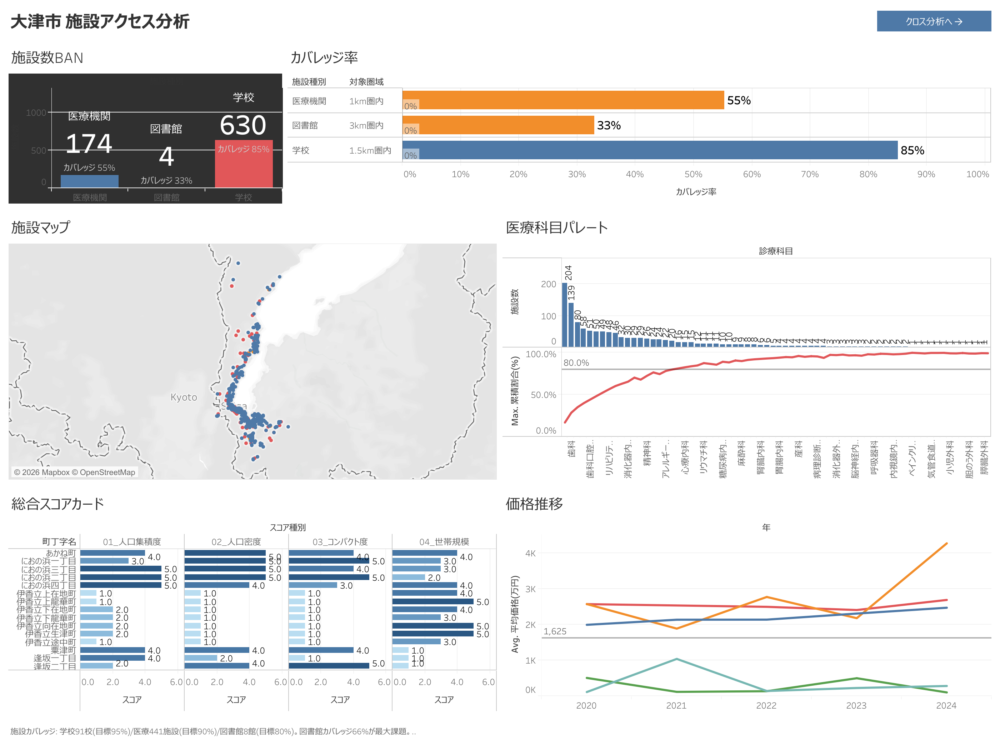
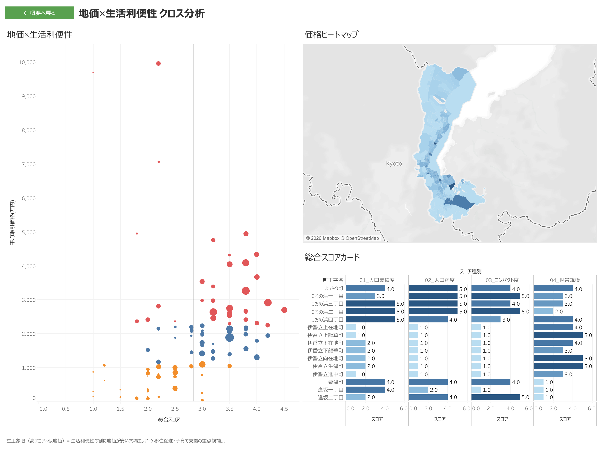
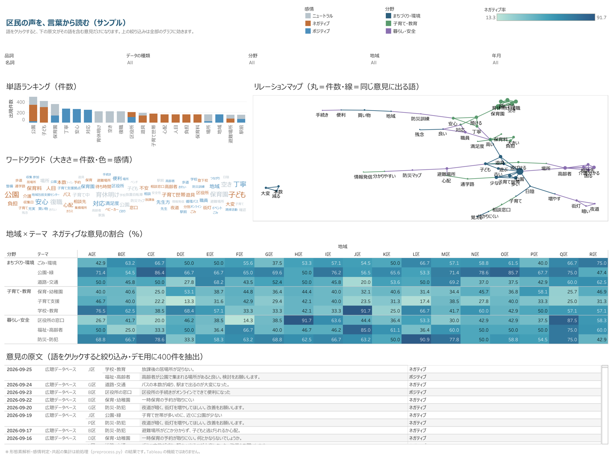

# Tableau TWB XML Toolkit

**Generate, edit, and publish Tableau workbooks (.twb) with LLM coding agents — pure Python + REST API. No MCP server required.** This toolkit lets any coding agent (Claude Code, Cursor, GitHub Copilot, ...) create Tableau workbook XML from CSVs, validate it against the official XSD schema, publish to Tableau Cloud with a PAT, and visually verify the rendered views — all through plain CLI scripts. The documentation below is in Japanese; the pattern catalog, agent skills, and knowledge base are also written in Japanese.

LLMコーディングエージェントが **MCPサーバなし** で Tableau ワークブック（.twb）を生成・編集・publish・描画検証するためのツールキットです。

## Disclaimer / 免責事項

This repository is a **personal research and validation project** by Masafumi Kawashima.

**This is NOT an official Salesforce or Tableau recommendation.**
**Salesforce社およびTableau社の公式推奨ではありません。**

TWB XML direct editing is not officially supported by Tableau. Use at your own risk.
The [XSD schema](https://github.com/tableau/tableau-document-schemas) was publicly released by Tableau in February 2026.

## Generated Dashboard Examples

These dashboards were generated entirely from XML — no Tableau Desktop involved.

### Facility Access Analysis (施設アクセス分析)

BAN cards, coverage bars with reference lines, facility map, pareto chart, scorecard, and price trends — all in a single dashboard.

### Cross Analysis (地域クロス分析)

Scatter plot with dual reference lines, choropleth map, and multi-dimension scorecard.

## なぜ「脱MCP」か

Tableau MCP サーバは強力ですが、導入にはコストがあります。

- **常駐プロセスが増える** — エージェントのコンテキストにツール定義が常時載り、セッションが重くなる
- **建てられない環境がある** — サンドボックス実行のエージェント、MCP非対応のエージェント、社内ポリシーでプロセス追加が難しい環境
- **やることの大半は REST で足りる** — list-workbooks / list-views / view-image / publish は全て REST API + PAT で完結する

このツールキットは、その「REST で足りる」部分を CLI スクリプト 3本（`tools/`）に切り出し、生成・編集のノウハウを XMLパターンカタログ（`docs/twb-patterns.md`・57パターン）と実戦ナレッジ 27本（`shared/memory/`）として同梱しています。エージェントは Python が実行できれば動きます。

```
従来:  エージェント ⇄ Tableau MCPサーバ ⇄ Tableau Cloud
本kit: エージェント ⇄ python tools/*.py ⇄ Tableau Cloud (REST + PAT)
```

## できること / できないこと

| | |
|---|---|
| ✅ できる | CSV群から .twb を XML直接生成（datasource/worksheet/dashboard/map/action/filter/parameter） |
| ✅ できる | 公式XSDによる構造検証、publish前のローカルチェック |
| ✅ できる | Tableau Cloud への publish（.twb→.twbx変換込み・PAT認証） |
| ✅ できる | 既存Cloud WBのDL → XMLテキスト編集 → re-publish |
| ✅ できる | 全ビューのPNG取得による描画検証（publish成功≠描画成功） |
| ✅ できる | Tableau Public Viz の TWBX解析・XMLパターン学習 |
| ❌ できない | Tableau Desktop の代替（最終の細部調整はDesktop/Web Editが速い） |
| ❌ できない | データ接続の追加認証が必要なライブ接続系（本kitはCSV/抽出前提） |

## セットアップ

```bash
git clone https://github.com/chami1221-eng/tableau-twb-xml-toolkit.git
cd tableau-twb-xml-toolkit
pip install -r requirements.txt

# 認証情報（PAT）を配置
cp .env.tableau.template .env.tableau
# → .env.tableau を編集して4項目を記入
```

`.env.tableau` の探索順（`tools/publish.py` / `tools/tableau_rest.py` 共通）:

1. 環境変数 `TABLEAU_ENV_FILE` で指定したパス
2. リポジトリ直下の `.env.tableau`
3. カレントディレクトリの `.env.tableau`
4. `~/.env.tableau`

疎通確認:

```bash
python tools/tableau_rest.py list-workbooks
```

## Claude Code で使う（推奨）

```bash
git clone https://github.com/chami1221-eng/tableau-twb-xml-toolkit.git
cd tableau-twb-xml-toolkit
pip install -r requirements.txt
claude          # リポジトリ直下で起動すると .claude/skills/ のスキルと CLAUDE.md を自動で読み込む
```

あとは日本語で頼むだけです（例: 「`examples/freetext/sample_opinions.csv` をテキスト分析のダッシュボードにして」）。
**Tableau MCP サーバは不要**です。Tableau Cloud への publish と確認は `tools/` の Python スクリプトが REST API で行います。
Cloud に出さず Tableau Desktop で開くだけなら、`.env.tableau` も要りません。

## クイックスタート

### 入口A: CSVから新規生成

エージェントに `.claude/skills/twb-generator/SKILL.md` を読み込ませ、CSV群を渡して生成を指示します。人手でやる場合の流れ:

```bash
# 1. 生成した .twb をXSD検証
python tools/publish_test.py my_workbook.twb --xsd

# 2. Tableau Cloud へ publish（--name 必須・csv_dir は絶対パス）
python tools/publish.py my_workbook.twb "C:/absolute/path/to/csv_dir" \
  --project "Your Project" --name "My Workbook"

# 3. 描画検証（publish成功≠描画成功。全ビューをPNGで目視）
python tools/tableau_rest.py view-image --workbook "My Workbook" --out ./verify
```

### 入口B: 既存Cloud WBを編集

`.claude/skills/twb-cloud-dl-xml-inject/SKILL.md` 参照。REST APIでDL → XMLをテキスト置換で編集 → re-publish。Web Edit の手動操作（calc追加・format修正・zone調整等）をコードで再現できます。

### 入口C: 自由記述（アンケート・市民の声）をテキスト分析する

`.claude/skills/freetext-to-tableau/SKILL.md` 参照。形態素解析・感情・共起・関係図の座標は Tableau の機能ではないので、Python で先に済ませて雛形ダッシュボードに差し込みます。

```bash
pip install janome openpyxl
# 1. 自由記述CSV → Tableau 用CSV（語・感情・共起・座標）
python .claude/skills/freetext-to-tableau/preprocess.py examples/freetext/sample_opinions.csv \
  --text 意見 --id 意見ID --area 区 --source データの種類 --group 分野 --theme テーマ --date 受付日 \
  --stopwords examples/freetext/stopwords_sample.txt --out out
# 2. 雛形 → twbx（上位語・色をデータに合わせて差し替え）
python .claude/skills/freetext-to-tableau/build_twbx.py out/freetext_union.csv -o out/自由記述分析.twbx
# 3. Desktop で開く、または Cloud へ
python tools/publish.py out/自由記述分析.twbx --project "Your Project" --name "自由記述分析"
```



単語ランキング／ワードクラウド／リレーションマップ（語をクリックすると下の原文一覧が絞られる）／地域×テーマのネガティブ率／原文一覧を1画面に置いています。
感情は既定では簡易辞書で付けます。文脈で意味が変わる語（「保育料が**高い**」と「安全性が**高い**」）は辞書では決まらないので、精度が要るときは Claude Code に1件ずつ判定させる手順を SKILL.md に書いています。

## エージェント用スキル（11本）

Claude Code ならそのまま skills として認識されます。他のエージェント（Cursor / GitHub Copilot 等）では、該当する SKILL.md を参照ドキュメントとしてコンテキストに読み込ませてください。

| スキル | 役割 |
|---|---|
| `freetext-to-tableau` | 自由記述 → 形態素解析・感情・共起・関係図座標 → テキスト分析ダッシュボード |
| `twb-generator` | CSV群から .twb をXML直接生成（本体） |
| `twb-cloud-dl-xml-inject` | 既存Cloud WBのDL→XML編集→re-publish |
| `verify-twb-publish-render` | publish後の全ビュー描画検証（list-views + view-image） |
| `twb-visual-iterator` | 生成→publish→画像取得→前回差分比較の反復ループ |
| `twb-xml-structure-diff` | 参考TWBと編集中TWBの構造差分検出（zone tree/filter属性等） |
| `twb-pattern-learner` | Tableau Public VizからXMLパターンを学習しカタログに追記 |
| `tableau-public-twb-analyzer` | Public VizのTWBX構造を自動解析・レポート生成 |
| `tableau-public-reference-finder` | テーマから参考Vizを Tableau Public で探索 |
| `twb-desktop-compat-converter` | Cloud由来TWBをDesktop 2026.1互換に変換（21項目+α） |
| `twb-public-export` | 生成TWBを Desktop / Tableau Public（2026.1）で開ける twbx に（伏せ字・互換変換・内容モデル検査・抽出手順） |

## リポジトリ構成

```
tableau-twb-xml-toolkit/
├── docs/
│   ├── twb-patterns.md      # XMLパターンカタログ（57パターン・実WB解析から抽出）
│   └── GUIDE.md             # 生成ルールと教訓（Correction Records）
├── schemas/                 # Tableau公式XSD（2026.1）
├── tools/
│   ├── publish.py           # .twb→.twbx変換 + Cloud publish（PAT認証）
│   ├── publish_test.py      # XML/XSD検証 + publishテスト + bisectデバッグ
│   └── tableau_rest.py      # 脱MCP参照ヘルパー（list-workbooks/list-views/view-image）
├── .claude/skills/          # エージェント用スキル11本（上表）。Claude Code が自動で読み込む
├── CLAUDE.md                # Claude Code が毎回読むルール（入口・接続・事故の実績があるルール）
├── shared/memory/           # 実戦ナレッジ34本（エラーコード集・XML互換性・Desktop互換・クリック連動等）
├── examples/                # 最小構成の動作するTWBサンプル／freetext/ = 自由記述の架空サンプル
├── .env.tableau.template    # 認証情報テンプレート
└── requirements.txt
```

## TWB XML編集の絶対ルール

実publish事故から確立したルールです。詳細は各ナレッジ（`shared/memory/`）参照。

1. **ElementTree / lxml での書き出し禁止** — 名前空間・属性順が破壊され Cloud が拒否する。編集は**テキスト置換のみ**（読み取り専用のXSD検証にlxmlを使うのはOK）
2. **publish失敗時はPATではなくXML構造を疑う** — エラーコード別の切り分けは `shared/memory/reference_twb_publish_error_codes.md`
3. **`publish.py` の `--name` は必須** — default依存は既存WBの上書き破壊事故につながる
4. **`csv_dir` は絶対パスで渡す** — 相対パスだとTWB内パスと置換不一致で FAKEPATH エラー
5. **datasourceは `<connection class='federated'>` ラップ構造を採用** — `textscan` 直接配置はWeb EditでのCalc作成が不能になる
6. **dashboard filter zone は `pane-specification-id` + `name` + `param` が必須。足すなら `mode`（例 `checkdropdown`）だけ** — `values` / `show-domain` 等を自己流で足すと 500000 で reject される。ドロップダウンは表示倍率に左右されないので、チェックボックスより崩れにくい
7. **Desktop / Public で開くなら `twb-public-export` を通す** — Cloud で通る XML でも Desktop 2026.1 は止まる（`shared/memory/feedback_twb_desktop_2026_gates.md`）

## トラブルシューティング

publish が 401002 / 400011 / 403132 / 500000 で失敗する場合は、まず
`shared/memory/reference_twb_publish_error_codes.md` を参照してください。16回以上の実publish切り分けに基づくエラーコード→原因→対処の対応表です。

| コード | 実体 |
|---|---|
| 401002 | PAT競合（連続sign-in）。30〜120秒待って再実行 |
| 400011 | XML parse失敗（cross-table calc注入・不正LOD等） |
| 403132 | CSV配置不整合（directory rewrite失敗） |
| 500000 | 「Forbidden」表示だが実体はXML構造エラー（window cards欠落・filter zone過剰属性等） |

## v2.1.0 の変更点

- **`freetext-to-tableau` を追加** — 自由記述 → 形態素解析（Janome）・感情・共起・関係図座標 → テキスト分析ダッシュボードの雛形
- **Claude Code 向けに構成を変更** — スキルを `.claude/skills/` へ移動、`CLAUDE.md` を追加、手順書のパスをリポジトリ直下基準に統一
- **`twb-public-export` を作り直し** — Desktop / Public 2026.1 で止まる4点（ManifestByVersion・action の形・並べ替えの位置・抽出）に対応。自己テスト付き
- `tools/publish.py` が `.twbx` をそのまま受け付けるように
- 実戦ナレッジを7本追加（静止画と実画面の違い・Desktop 2026.1 の壁・クリック連動・縦積みUNION・二重軸・リレーションマップ・slices）

## v1からの変更点（v2.0.0）

- エージェント用スキル10本と実戦ナレッジ27本（`shared/memory/`）を追加
- `docs/twb-patterns.md` を57パターンに拡充（実WB解析ベース）
- `tools/tableau_rest.py` を追加 — MCPサーバなしで参照系（list/view-image）が完結
- `tools/publish.py` に `.env.tableau` 多段フォールバック探索を追加
- 位置づけを「脱MCP汎用ツールキット」として再定義（特定エージェント非依存）

## Contributing

Contributions are welcome — especially new XML patterns and correction records. See [CONTRIBUTING.md](CONTRIBUTING.md) for guidelines.

## License

Apache License 2.0 - See [LICENSE](LICENSE)
